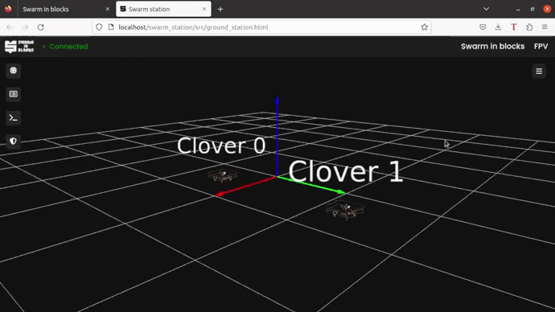

---

## Table of contents
- [Motivation](#motivation)
- [Composition](#composition)
- [Software build](#software-build)
    - [Clone sources](#clone-sources)
    - [Build with `cmake`](#build-with-cmake)
    - [Build with `make`](#build-with-make)
    - [Build with `msbuild`](#build-with-msbuild)
    - [Build with IDE](#build-with-ide)
- [Integration](#integration)
    - [Integrate for development](#integrate-for-development)
    - [Configure multicast router](#configure-multicast-router)
    - [Configure logging](#configure-logging)
- [Roadmap](#roadmap)
- [Interface-centricity](#interface-centricity)
- [More than embedded](#more-than-embedded)
- [Use cases and benefits](#use-cases-and-benefits)
    - [Distributed solution](#distributed-solution)
    - [Driverless devices](#driverless-devices)
    - [Real-time solutions](#real-time-solutions)
    - [Digital twin](#digital-twin)
    - [Simulation and tests](#simulation-and-tests)
- [Examples](#examples)
- [License](#license)
- [Call to action](#call-to-action)

---

## Introduction 
---

Nowadays, **swarms of drones** are getting more and more applications and being used in several different areas, from agriculture to surveillance and rescues. But controlling a high amount of drones isn't a simple task, demanding a lot of studies and complex software.

Swarm in Blocks (from it's origin in 2022) was born looking to make a *high-level interface based on the blocks language*, to make simple handling swarms, without requiring advanced knowledge in all the necessary platforms, creating tools to allow a lot of applications based on the user needs and also using the Clover platform.

In 2023, Swarm in Blocks has taken an even bigger step, looking to fulfill our biggest vision **"It's never been easy to Swarm"**, we talk to transcend the local scope of the past project and explore the biggest problems for implementing a Swarm. For Copterhack 2023, we present Swarm in Blocks 2.0, an even more complete platform with the purpose of facing the biggest difficulties of a Swarm in a simple and polished way.

### Swarm in Blocks 2022 

---

Swarm in Blocks is a CopterHack 2022 project. It's a high-level interface based on the blocks language, which consists of fitting code parts, like a puzzle. Each script represents a functionality, for example, conditional structures, loops, or functions that receive parameters and return an instruction to the swarm. 

For more information on our project from last year, see our final article in [Swarm in Blocks 2022](https://clover.coex.tech/en/swarm_in_blocks.html).

Even with the huge facilities that the block platform offers, we realized that this was just the tip of the iceberg when it comes to deploying real swarms. Several other operational and conceptual problems in validating a real swarm still haunted the general public. With that, this year's project comes precisely with the purpose of tackling the main problems in validating a Swarm in a simple and polished way.

### What's new

---

As already mentioned, of the various problems that can increase the complexity of a real swarm, we decided to deal with the ones that most afflicted us and reintegrated our solutions into our central platform, building a single extremely complete and cohesive platform.

| Problem | Our Solution |
| -------- | -------- |
| Possible collision between drones (lack of safety especially for large Swarms)  | Collision Avoidance System  |
| Giant clutter to keep track of all Clovers in a swarm individually (several terminals, many simulateneo computers with several people to keep track of)  | Swarm Station  |
| Lack of basic features for handling a swarm pre-implemented in the Clover platform (such as access to battery data and raspberry computational power)  | Full integration of low level data in our Swarm Station  |
| Lack of security in indoor tests regarding the limitation of physical space (walls and objects) in the Swarm region  | Safe Area Pop Up in Swarm Station  |
| Decentralization of information and platforms for access  | Web Homepage  |
| Difficulty configuring physical drones for swarm  | Our complete documentation with pre-designed settings for swarms in our repo image  |
| Lack of a center for reports of successful tests with swarms of drones for the Clover platform describing the test conditions (odometry, etc.)  | Show off section in our Gitbook  |

And many other solutions are also featured on our platform, for more information please check the solutions described clearly and in detail throughout our **Gitbook**. We recommend reading in order to understand the fundamental precepts of our platform. 

> 📖 **Acess our [Gitbook](https://app.gitbook.com/s/C9O11TiXK1JPnlrpilLg/background-theory/system)!**

## Getting started 

---

## Usage - modes 

---
REFORMULAR ESTES PARAGRAFOS

- *Planning Mode:* Its main goal is to allow the user to check the drones' layout, save and load formations, before starting the simulator or using real clovers. In order to need less computational power and avoid possible errors during the simulation.
- *Simulation Mode:* In this mode happens the simulation indeed, starting the Gazebo, the necessary ROS nodes and some other tools. It allows applying the developed features, which will be explained ahead and see how they would behave in real life.
- *Navigation Mode:* The last mode will support executing everything developed in real clovers so that it's possible to control a swarm with block programming. The biggest obstacle yet is the practical testing of this mode, due to the financial difficulty of acquiring a Clover swarm.

## New Swarm Features 

---

We developed new features

### Swarm Station

The main feature from our platform is the *Swarm Station*, which is a **3d Web Visualizer** that shows in real time all the necessary information regarding the drones state, such as real time positioning and visualization, which clover is connected, the topics available and a lot more. Also, you can define a safe area to ensure each drones safety, forcing them to land in case they cross the forbidden area. The front end runs completely on the web browser, saving processing and installation resources. 

    

This package uses the ROS suite `rosbridge_server` to establish a communication between the ROS environment and the web server. 

To run it, we recommend using **Firefox** browser to assure stability. But feel free to test it on other navigators. 

If you launched our `simulation.launch` from the `swarm_in_blocks` package, then you just have to run

    roslaunch swarm_station swarm_station.launch

Otherwise, you have to make sure that the `rosbridge_websocket` is running on port `9090`:
    
    roslanch rosbridge_server rosbridge_websocket.launch port:=9090 
    
For more detailed instructions on how to use each single feature from the Swarm Station, check our [Gitbook page about the station](https://swarm-in-blocks.gitbook.io/swarm-in-blocks/). 

### Swarm Collision Avoidance

### Rasp Package

### Swarm FPV

### Swarm in Blocks

### Swarm Clover Blocks

### Swarm Checker

### Swarm Examples

---

---

### Real Swarm

---