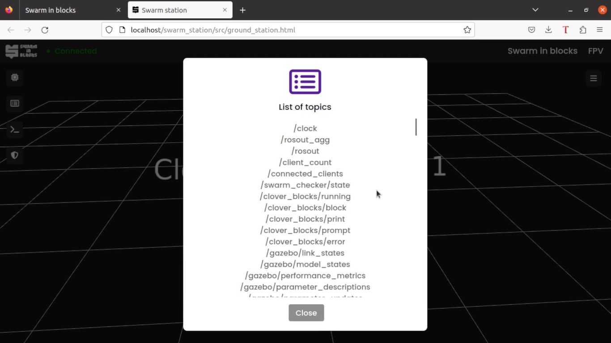
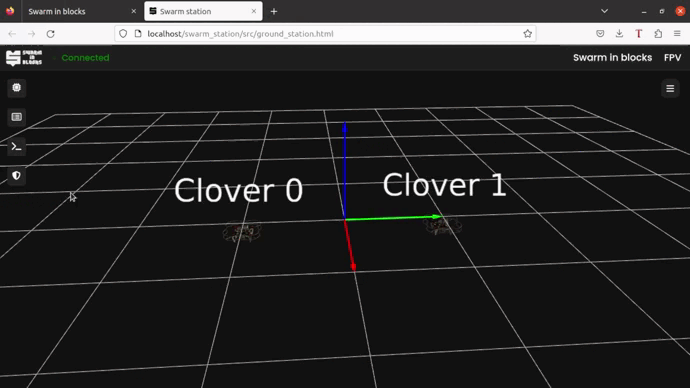

# Swarm Station

The `swarm_station` package it's the responsible for running the **Swarm Station** backend. It uses `tf2_web_republisher` package alongside with `roslibjs` and `ros3djs` set of libraries to serve the 3d web visualizer. Behind the scenes, there's a python server that listens to important swarm topics provided by `mavros` and `swarm_checker_node` and handles the creation and configuring of the [markers array](http://wiki.ros.org/rviz/DisplayTypes/Marker), which are published to topics such as `/vehicle_marker` so that the web client can subscribe to it and then render all drone information on web. This dispenses the use of other softwares to run our application, since it runs almost completly on web. Also, it's possible to access the Swarm Station on pretty much any device connected to the same network in which the host is serving our platform. For further details, please read our [gitbook](https://swarm-in-blocks.gitbook.io/swarm-in-blocks/introduction/swarm-in-blocks).
## How to run individually
To run the web 3d swarm visualizer individually (after installing all the dependencies) you just need to check wether or not `rosbridge_server` node is running, since it's the node that handles the communication between ROS applications and web servers. 
Our default simulation launch for clover swarms has the rosbridge webserver flag set to **true**, so in this case to run the visualizer:

    roslaunch swarm_station swarm_station.launch
If `rosbridge_server` node isn't already running, then we just have to add the arg `sep:=true` to the end of the command line above.

    roslaunch swarm_station swarm_station.launch sep:=true

Its default port for communication between ROS applications and the web server is **9090**.
If you correctly configured [apache](https://httpd.apache.org/) to host our platform (details in our gitbook) it's quite simple to visualize the server from another device connected to the same network as the host. In order to do that, we can simply type the **host private ip** on any web browser. To get the IP:

	hostname -I

## Motivation

If flying a drone alone is no longer easy, imagine a swarm all at once. The Swarm Station, seeking ease and greater usability for the user, is a **completely integrated station** that brings together several processes and functionalities that previously resulted in numerous terminals and screens in one place, all of this aimed not at a single drone, but at a swarm of them.

## Main information
For a quick view of the most essential information of each drone there is an **information center** that brings the data of each drone in addition to the existence of a **land all button** for emergency cases so that all drones land.

In addition to this partition, we have the left bar where some additional features are present. These are:

### Drone's process

In this part, the user has access to the hardware information of each clover brought from the raspberry pi of the clover in an easy and comparative way, facilitating the identification of problems. 

### Topic list

To avoid the need for another terminal to be opened, a feature was created that shows a list of topics currently active, through these topics it is possible to analyze the calls and procedures that are being carried out.

### Terminal web

This functionality brings a true terminal within the web with the ease of being able to manipulate information directly from the web and avoid the need to divide screens, one to control the drone and another to send commands to it.

In addition, it is possible to create more than one terminal simultaneously, this creation of several terminals happens in an intuitive and facilitated way so that several processes can be run at the same time.

### Safe area

An additional resource is the safe area that allows defining an area of ​​defined format according to the user's interest in which the drones must operate, if a drone passes through this area, it is forcibly landed immediately, ensuring even more safety and robustness to the project.

